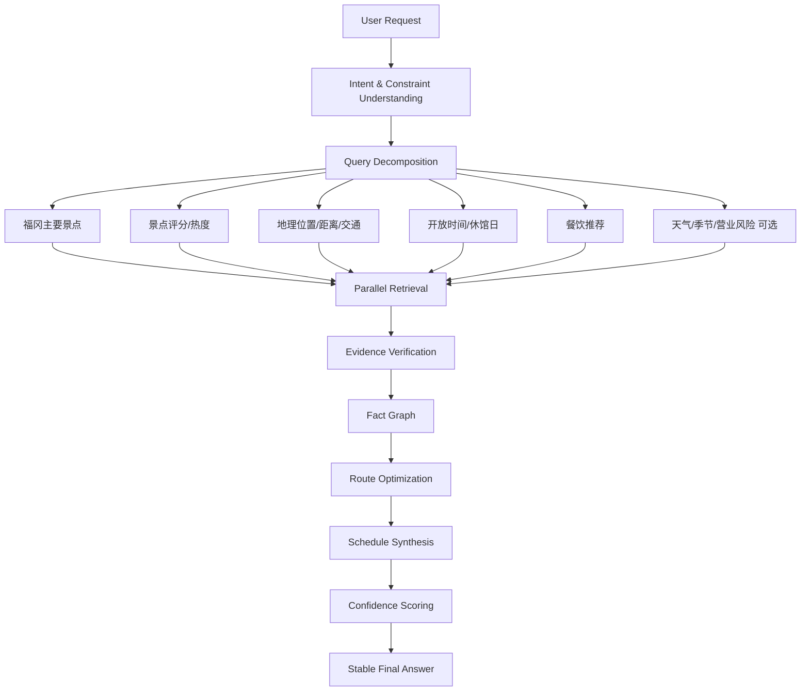

# cdac-nesthub v70.29 能力验证与改进路线图

生成日期：2026-05-16  
分析对象：`cdac-nesthub.zip` 最新版代码与 `runtime/traces` 测试内容

---

## 1. 验证结论

当前 v70.29 **已经具备部分雏形**，但还没有达到你定义的目标：

> Multi-source Evidence Validation + Task Decomposition Graph + parallel retrieval + route optimization + schedule synthesis + stable synthesis + Universal MCP + Self-healing Runtime

准确判断如下：

| 能力项 | 当前状态 | 结论 |
|---|---:|---|
| 多源证据验证 | 有 `MultiSourceEvidenceFusion`、`EvidenceContractValidator` 雏形 | 未达到真正多源交叉验证 |
| Query decomposition | workflow planning 能生成步骤，但不是稳定 query decomposition graph | 未达到 |
| 子任务并行 | 当前 base workflow 是线性节点 | 未达到 |
| Parallel retrieval | 搜索/fetch 有多候选，但没有并行子任务编排 | 未达到 |
| Evidence verification | 有质量验证/短路/contract 雏形 | 部分达到 |
| Route optimization | 有 `CostAwareRouter`、`ExecutionGraphOptimizer` | 部分达到，未和真实执行图深度集成 |
| Schedule synthesis | 没有真正行程时间表合成器 | 未达到 |
| 推理式 synthesis | 有 FinalAnswerSynthesizer，但主要是清洗与拼接 | 未达到稳定推理式综合 |
| Confidence scoring | 有局部 confidence | 部分达到，缺少全链路置信度模型 |
| Playwright Browser Runtime | requirements 有 playwright，代码是静态 markup adapter | 未达到真正浏览器运行时 |
| Persistent Agents | 未看到完整 persistent agent registry/runtime | 未达到 |
| Runtime-generated Schemas | 有 generated schemas，但 schema runtime 生成范围有限 | 部分达到 |
| Universal MCP Runtime | 有 `mcp_call_executor.py` | 只是 executor 雏形，未达到 full orchestration |
| Self-healing Runtime | 有 schema/result repair/fallback | 未达到 autonomous repair |
| Runtime failure taxonomy | 有 `FailureClassifier` | 雏形，分类过粗 |
| Deterministic tests | 当前 10 个相关测试通过 | 部分达到，覆盖不足 |

本地验证结果：

```text
PYTHONPATH=/mnt/data/cdac_nesthub pytest -q \
  tests/runtime/test_v70_26_runtime_capabilities.py \
  tests/verification/test_v70_29_final_synthesis_and_credentials.py \
  tests/verification/test_v70_28_evidence_short_circuit.py

10 passed in 7.24s
```

说明：这些测试证明 v70.26～v70.29 的基础能力没有坏，但测试内容偏“单元雏形验证”，还不能证明系统已经具备复杂旅行规划类任务的真实 runtime 能力。

---

## 2. 以“介绍福冈景点，并整理一天路线”为目标的正确 runtime 架构

目标请求：

```text
介绍福冈景点，并整理一个一天观光路线
```

正确的 Task Decomposition Graph 应该不是简单线性 workflow，而是：



应该生成的子任务至少包括：

| 子任务 | 需要的数据 | 推荐工具 |
|---|---|---|
| 1. 福冈主要景点 | 景点清单、分类、简介 | Web search / 官方旅游站 / TripAdvisor / Google-like source |
| 2. 景点评分 | 评分、评论数量、热度 | TripAdvisor / Google Places / 旅游平台 |
| 3. 地理距离 | 经纬度、站点、步行/电车时间 | Maps API / geocoding / distance matrix |
| 4. 开放时间 | 营业时间、休馆日、最后入场 | 官方网站优先 |
| 5. 路线优化 | 空间聚类、交通时间、停留时间 | route optimizer |
| 6. 餐饮推荐 | 午餐/晚餐区域、预算、类别 | restaurant search / Tabelog-like / official guide |
| 7. 时间安排 | 09:00～20:00 行程表 | schedule synthesizer |

---

## 3. 当前代码中已经存在的基础模块

### 3.1 Evidence / Fact Graph 雏形

已存在：

```text
ai_core/runtime/evidence/structured_fact_graph.py
ai_core/runtime/evidence/multi_source_fusion.py
ai_core/runtime/verification/evidence_contract.py
ai_core/execution/evidence_quality_validator.py
ai_core/execution/evidence_satisfied_short_circuit.py
```

当前能力：

- 可以从 evidence text 中抽取数字、时间、附近 label。
- 可以把多个 fact 列表合并。
- 可以计算简单 source_count / fact_count / confidence。

问题：

- 事实类型过于通用，只抽数字和时间，不能稳定表达“景点、评分、距离、开放时间、餐厅、路线节点”。
- 多源融合只是去重和平均置信度，不是真正的 cross-source agreement。
- 没有 contradiction detection。
- 没有 source authority scoring。
- 没有 claim-level evidence contract。

### 3.2 Browser Runtime 雏形

已存在：

```text
ai_core/runtime/browser/browser_runtime_adapter.py
requirements.txt: playwright>=1.44.0
```

当前能力：

- 可以从静态 HTML/已渲染 markup 中抽取 visible text 和 DOM attribute。

问题：

- 没有真正调用 Playwright。
- 没有 browser context/session reuse。
- 没有 wait strategy。
- 没有 network capture。
- 没有 screenshot evidence。
- 没有 anti-bot 策略。
- 没有 page-level trace bundle。

因此目前不能称为“真正 Playwright Browser Runtime”。

### 3.3 Routing / Optimization 雏形

已存在：

```text
ai_core/runtime/routing/cost_aware_router.py
ai_core/runtime/execution_graph_optimizer.py
```

当前能力：

- 可以根据 quality、latency、cost、local bonus 对候选排序。
- 当 verified material 存在时，可以跳过 tool_generation。

问题：

- 还不是 route optimization for travel itinerary。
- 没有空间距离矩阵。
- 没有营业时间约束。
- 没有用户偏好/时间窗/交通方式约束。
- 没有 multi-objective optimizer。

### 3.4 Generated Code Execution Validation 雏形

已存在：

```text
ai_core/runtime/generated_execution/generated_code_runner.py
ai_core/runtime/generated_execution/shell_runtime_executor.py
ai_core/runtime/verification/generated_execution_validator.py
```

当前能力：

- 可以执行简单 Python/Shell。
- 可以检查结果是否带 source_url/facts。

问题：

- 缺少 sandbox resource limit。
- 缺少 import/network/file system policy。
- 缺少 generated code test case 自动执行。
- 缺少安全审计与 provenance 强绑定。

### 3.5 Failure Taxonomy 雏形

已存在：

```text
ai_core/runtime/verification/failure_taxonomy.py
```

当前分类：

```text
fetch_failed
extract_failed
materialization_failed
verification_failed
routing_failed
synthesis_failed
execution_failed
```

问题：

- 分类太粗。
- 没有 provider_timeout、anti_bot_blocked、captcha、schema_drift、low_confidence、conflict_evidence、source_stale、wrong_entity、human_review_blocked 等实际运行常见错误。
- 没有 repair strategy mapping。

---

## 4. 当前 runtime trace 暴露的问题

### 4.1 福冈景点介绍回答过短

现有 trace 中，福冈景点请求最终只输出类似：

```text
Fukuoka offers 21 must-visit tourist attractions...
```

问题：

- 没有景点列表。
- 没有分类。
- 没有评分。
- 没有开放时间。
- 没有路线。
- 没有餐饮。
- 没有多源比较。

### 4.2 一天路线类请求没有真正分解

当前 workflow 仍是：

```text
input_parsing
intent_recognition
context_awareness
workflow_planning
execution
feedback_learning
output
```

这是 stage workflow，不是 task graph。

真正需要的是：

```text
workflow stage graph + task decomposition graph + evidence graph + route graph
```

也就是说：

- stage workflow 管节点生命周期。
- task graph 管用户问题拆解。
- evidence graph 管证据和事实。
- route graph 管景点、距离、时间窗、顺序。

### 4.3 多源证据没有达到“验证”级别

当前 web evidence 会 fetch 多个候选，但最终经常选一个最高分候选直接回答。

真正的 Multi-source Evidence Validation 应该满足：

```text
每个最终 claim 至少绑定 2 个来源；
开放时间/价格/地址等动态信息优先官方来源；
评分/热度类信息允许平台来源，但必须标注来源；
不同来源冲突时，不直接合成确定结论，而是降置信度或说明差异；
每个子任务有 evidence contract；
最终回答只能引用 verified_fact_graph 中的 facts。
```

---

## 5. 需要新增/完善的核心模块

建议按以下模块新增，而不是把逻辑写死到 `ai_core`。

### 5.1 Task Decomposition Graph Runtime

新增：

```text
ai_core/runtime/task_graph/
  task_graph_schema.py
  query_decomposer.py
  task_graph_builder.py
  task_graph_executor.py
  parallel_task_scheduler.py
  dependency_resolver.py
```

runtime generated schema：

```text
runtime/generated/schemas/task_graph.schema.json
runtime/generated/schemas/query_decomposition.schema.json
runtime/generated/schemas/subtask_result.schema.json
```

核心结构：

```json
{
  "graph_id": "...",
  "root_request": "...",
  "nodes": [
    {
      "task_id": "attraction_candidates",
      "task_type": "information_retrieval",
      "query": "Fukuoka major tourist attractions official guide",
      "required_evidence": {
        "min_sources": 2,
        "preferred_source_types": ["official", "review_platform", "map"]
      },
      "depends_on": [],
      "parallel_group": "retrieval_1"
    }
  ],
  "edges": [
    {"from": "attraction_candidates", "to": "route_optimization"}
  ]
}
```

### 5.2 Parallel Retrieval Runtime

新增：

```text
ai_core/runtime/retrieval/
  retrieval_plan.py
  parallel_retriever.py
  source_policy.py
  retrieval_result_normalizer.py
```

要求：

- `asyncio.gather` 并行执行多个 retrieval tasks。
- 每个 task 支持多工具：web search、browser、API、MCP、local knowledge。
- 每个 result 必须进入 evidence contract。
- 失败不能直接终止全部 graph，要进入 failure taxonomy。

### 5.3 Strict Evidence Contracts

新增/增强：

```text
ai_core/runtime/evidence/
  evidence_contract_schema.py
  claim_evidence_linker.py
  source_authority_scorer.py
  contradiction_detector.py
  freshness_validator.py
  fact_graph_validator.py
```

最终回答前强制断言：

```text
assert_every_claim_has_evidence
assert_min_source_count_per_claim
assert_no_unverified_dynamic_claim
assert_no_debug_material_in_final_answer
assert_confidence_above_threshold_or_explain_uncertainty
```

### 5.4 Route Optimization Runtime

新增：

```text
ai_core/runtime/route/
  route_graph.py
  distance_matrix_builder.py
  time_window_constraint.py
  itinerary_optimizer.py
  route_score.py
```

注意：这些模块保持通用，不写死“福冈”“景点”等业务词。可用通用术语：

```text
place
candidate_place
opening_window
travel_duration
stay_duration
meal_window
route_node
route_edge
```

### 5.5 Schedule Synthesis Runtime

新增：

```text
ai_core/runtime/schedule/
  schedule_schema.py
  schedule_synthesizer.py
  schedule_validator.py
  conflict_checker.py
```

输出结构：

```json
{
  "schedule_items": [
    {
      "start": "09:00",
      "end": "10:15",
      "title": "...",
      "location": "...",
      "reason": "...",
      "evidence_refs": ["claim_001", "claim_002"]
    }
  ],
  "validation": {
    "time_conflict_free": true,
    "opening_hours_satisfied": true,
    "travel_time_satisfied": true
  }
}
```

### 5.6 Stable Final Synthesis

增强：

```text
ai_core/presentation/final_answer_synthesizer.py
```

新增：

```text
ai_core/presentation/stable_synthesis.py
ai_core/presentation/answer_plan_builder.py
ai_core/presentation/claim_table_renderer.py
```

最终回答必须从以下输入生成：

```text
verified_fact_graph
route_plan
schedule_plan
confidence_report
```

禁止直接读取：

```text
raw web text
raw extraction trace
debug material
unverified generated code output
```

---

## 6. 真正 Playwright Browser Runtime 要求

新增：

```text
ai_core/runtime/browser/playwright_runtime.py
ai_core/runtime/browser/browser_session_manager.py
ai_core/runtime/browser/wait_strategy.py
ai_core/runtime/browser/network_capture.py
ai_core/runtime/browser/screenshot_evidence.py
ai_core/runtime/browser/anti_bot_policy.py
```

能力要求：

| 能力 | 要求 |
|---|---|
| session reuse | 同一 domain/context 复用 cookies、UA、locale |
| anti-bot | 合理 UA、viewport、locale、rate limit、robots/ToS policy，不做违法绕过 |
| wait strategy | domcontentloaded/networkidle/selector/text/timeout fallback |
| network capture | 保存 request/response、status、content-type、API JSON |
| screenshot evidence | 每个关键页面可生成 screenshot hash/path |
| trace bundle | 每次 fetch 生成 browser_trace.json |
| reliability | timeout、retry、fallback to httpx/browser/API |

注意：anti-bot 只能做正常浏览器兼容与稳定性处理，不能设计绕过验证码、账号限制、付费墙或访问控制的规避逻辑。

---

## 7. 真正 Agent Runtime 要求

新增：

```text
ai_core/runtime/agents/
  persistent_agent_registry.py
  agent_state_store.py
  agent_profile_schema.py
  agent_memory_policy.py
  agent_tool_binding.py
  agent_lifecycle_manager.py
```

要求：

- agent 有 ID、role、capabilities、tool bindings、memory policy。
- agent state 可持久化。
- agent 不直接写入业务逻辑到 core。
- agent 的 prompt、schema、tool preference 存在 runtime/generated 或 runtime/configs。
- agent 输出必须走 evidence contract 与 execution assertions。

---

## 8. 真正 Runtime-generated Schemas 要求

当前已有：

```text
runtime/generated/schemas/*.schema.json
ai_core/validation/schema_auto_repair.py
```

需要扩展为全面生成：

```text
runtime/generated/schemas/workflow_structure.schema.json
runtime/generated/schemas/trace_structure.schema.json
runtime/generated/schemas/fact_graph.schema.json
runtime/generated/schemas/evidence_contract.schema.json
runtime/generated/schemas/route_graph.schema.json
runtime/generated/schemas/schedule.schema.json
runtime/generated/schemas/agent_profile.schema.json
runtime/generated/schemas/mcp_tool_contract.schema.json
```

要求：

- schema 由 runtime 根据 task graph 动态生成或选择模板生成。
- schema 变化必须记录 provenance。
- schema repair 不能静默放宽安全约束。
- schema 生成后必须有 validation tests。

---

## 9. 真正 Universal MCP Runtime 要求

当前：

```text
ai_core/executors/mcp_call_executor.py
```

还不够。需要：

```text
ai_core/runtime/mcp/
  mcp_server_registry.py
  mcp_capability_discovery.py
  mcp_tool_schema_importer.py
  mcp_call_planner.py
  mcp_session_manager.py
  mcp_result_normalizer.py
  mcp_evidence_adapter.py
  mcp_failure_handler.py
```

能力要求：

- 自动发现 MCP server。
- 导入 MCP tools schema。
- 将 MCP tool 映射到 capability。
- 根据 task graph 选择 MCP tool。
- 执行结果进入 evidence/fact graph。
- MCP 失败进入 failure taxonomy。
- MCP tool 输出不能直接进入 final answer，必须先验证。

---

## 10. 真正 Self-healing Runtime 要求

当前已有：

```text
schema_auto_repair.py
result_auto_repair.py
planning_recovery.py
execution_state_repair.py
fallback
```

但这只是 repair/fallback，不是 autonomous repair。

真正 Self-healing 应该有：

```text
ai_core/runtime/self_healing/
  failure_diagnoser.py
  repair_strategy_selector.py
  repair_action_executor.py
  repair_result_verifier.py
  repair_memory.py
  rollback_manager.py
```

修复闭环：

```text
failure detected
  ↓
classified by failure taxonomy
  ↓
root cause diagnosis
  ↓
repair plan generated
  ↓
safe repair executed
  ↓
verification tests run
  ↓
if passed: resume
  ↓
if failed: rollback/escalate/human review
```

示例：

| Failure | Repair |
|---|---|
| source blocked | switch source / browser fallback / reduce request rate |
| schema mismatch | generate compatible schema patch + regression test |
| low evidence confidence | add retrieval tasks / query expansion |
| contradictory evidence | mark conflict + prefer official source |
| generated code failed | capture stderr + patch code + rerun tests |
| route infeasible | reduce places / change order / extend day length |

---

## 11. 必须新增的测试体系

### 11.1 Deterministic Runtime Tests

新增：

```text
tests/runtime/test_task_decomposition_graph.py
tests/runtime/test_parallel_retrieval_runtime.py
tests/runtime/test_evidence_contract_strict.py
tests/runtime/test_route_schedule_synthesis.py
tests/runtime/test_stable_synthesis.py
```

### 11.2 Execution Assertions

必须断言：

```text
query_decomposition.executed == true
parallel_retrieval.executed == true
evidence_verification.executed == true
route_optimization.executed == true
schedule_synthesis.executed == true
final_answer.only_uses_verified_claims == true
```

### 11.3 Strict Evidence Contract Tests

断言：

```text
每个 claim 有 evidence_refs
每个动态 claim 至少 2 个 source 或官方 source
source_url 不为空
source_type 不为空
fetched_at 不为空
confidence 不低于阈值
冲突信息不能被当作确定事实输出
```

### 11.4 Generated Code Execution Validation

断言：

```text
generated code must run in sandbox
generated code must have tests
generated code output must link evidence
generated code failure must be classified
generated code repair must rerun validation
```

### 11.5 Web Retrieval Reliability

断言：

```text
httpx fetch success path
browser fetch success path
network capture exists
screenshot evidence exists
retry policy works
timeout classified correctly
source stale classified correctly
wrong entity classified correctly
```

### 11.6 Runtime Failure Taxonomy

新增分类建议：

```text
provider_unavailable
provider_timeout
model_json_invalid
schema_validation_failed
schema_drift
fetch_http_error
fetch_timeout
anti_bot_blocked
captcha_detected
network_capture_failed
extract_empty_content
wrong_entity
source_stale
low_source_count
low_confidence
contradictory_evidence
route_infeasible
schedule_conflict
generated_code_syntax_error
generated_code_runtime_error
generated_code_policy_violation
mcp_server_unavailable
mcp_schema_mismatch
human_review_blocked
synthesis_unverified_claim
```

---

## 12. 建议版本推进顺序

### v71：Task Decomposition Graph + Parallel Retrieval

目标：让“福冈景点 + 一天路线”能拆成多个并列子任务，并行获取资料。

交付：

```text
task_graph schema
query_decomposer
parallel_task_scheduler
parallel_retriever
execution assertions
```

### v72：Strict Evidence Contracts + Fact Graph v2

目标：每个最终 claim 都必须有 evidence refs。

交付：

```text
claim evidence linker
source authority scorer
contradiction detector
freshness validator
strict synthesis gate
```

### v73：Route Optimization + Schedule Synthesis

目标：能生成真正一天路线。

交付：

```text
place graph
distance matrix
time window validation
itinerary optimizer
schedule synthesizer
```

### v74：Playwright Browser Runtime

目标：真正浏览器执行。

交付：

```text
session manager
wait strategy
network capture
screenshot evidence
browser trace bundle
```

### v75：Universal MCP Runtime

目标：MCP server/tool 可发现、可编排、可验证。

交付：

```text
mcp registry
mcp schema importer
mcp call planner
mcp evidence adapter
```

### v76：Persistent Agent Runtime

目标：agent 可持久化、可复用、可绑定工具。

交付：

```text
agent registry
agent state store
agent lifecycle manager
agent memory policy
```

### v77：Self-healing Runtime

目标：从 fallback 升级到 autonomous repair。

交付：

```text
failure diagnoser
repair strategy selector
repair action executor
rollback manager
repair verification tests
```

---

## 13. 最终判断

当前 v70.29 的定位应该是：

```text
Verified Evidence Short-circuit + Basic Runtime Capability Skeleton
```

不应该称为：

```text
Full Multi-source Evidence Validation Runtime
Full Task Decomposition Graph Runtime
Full Agent Runtime
Full MCP Runtime
Full Self-healing Runtime
```

下一步最优先不是继续增强最终回答，而是先补齐：

```text
1. Task Decomposition Graph
2. Parallel Retrieval
3. Strict Evidence Contract
4. Claim-level Fact Graph
5. Schedule/Route Synthesis
```

因为没有这 5 个基础，后面的 Playwright、MCP、Agent、Self-healing 即使做出来，也只是工具层增强，不能保证复杂任务最终回答稳定、可信、可验证。
